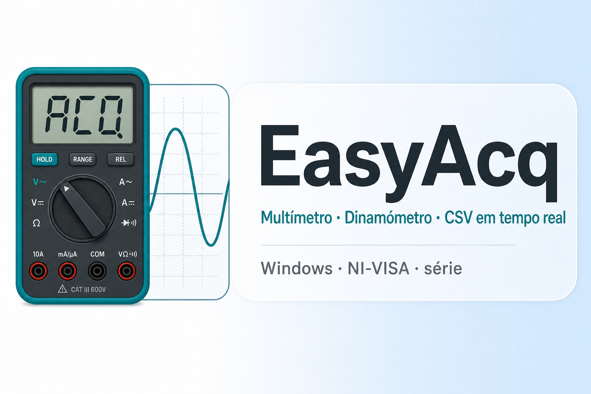

<p align="center">
  
</p>

<p align="center">
  <a href="https://github.com/joaquim1295/EasyAcq/releases/latest"></a>
  
  
</p>

# EasyAcq

Aplicação **Windows** para **aquisição em bancada**: **multímetro digital** Siglent SDM3055 (via **NI-VISA**) e **dinamómetro** (porta série), com painéis em tempo real, gráficos e registo **CSV** por sessão. Desenvolvida para apoiar ensaios e **controlo de qualidade** na **Nanopaint, Lda.**

| | |
|:---|:---|
| **Código-fonte** | [github.com/joaquim1295/EasyAcq](https://github.com/joaquim1295/EasyAcq) |
| **Instalação** | [Releases — descarregar instalador ou ZIP](https://github.com/joaquim1295/EasyAcq/releases/latest) |
| **Assinatura do instalador** | Ver [docs/code_signing.md](docs/code_signing.md) (SmartScreen / editor identificado) |

---

## Funcionalidades

- Ligação ao **SDM3055** (VISA) e ao **dinamómetro** (COM), com reconexão automática.
- **Valores ao vivo** e **gráficos** (multímetro, dinamómetro e vista integrada opcional).
- **CSV por sessão** em `data\`, com metadados no cabeçalho.
- **Exportação** de séries, PNG e registo formatado (opções na aplicação).

---

## Requisitos no PC (antes de instalar)

| Requisito | Nota |
|-----------|------|
| **Windows 10 ou 11 (64 bits)** | Não existe build para Windows 32 bits. |
| **Visual C++ Redistributable 2015–2022 (x64)** | [Microsoft — VC++ Redistributable](https://learn.microsoft.com/en-us/cpp/windows/latest-supported-vc-redist). Muitos PCs já o têm; o instalador pode avisar se faltar. |
| **NI-VISA** | Necessário para o **multímetro** USB/GPIB. [NI-VISA](https://www.ni.com/en/support/downloads/drivers.download-ni-visa.html). Só dinamómetro em série: **sem** NI-VISA. |

---

## Instalação rápida

1. Abra **[Releases](https://github.com/joaquim1295/EasyAcq/releases)** e descarregue a última versão.
2. **Recomendado:** `EasyAcq_Setup_X.Y.Z.exe` — assistente Inno (ícone da app + imagens do wizard), instalação em `%LocalAppData%\Programs\EasyAcq`.
3. **Alternativa:** `EasyAcq-windows.zip` — extraia **toda** a pasta e execute `EasyAcq.exe` (deve existir `_internal` ao lado do `.exe`).
4. Instale **VC++** e **NI-VISA** se ainda não tiver (tabela acima).

---

## Desenvolvimento

Requer **Python 3.11 ou 3.12** (recomendado **3.12**).

```powershell
py -3.12 -m venv .venv
.\.venv\Scripts\Activate.ps1
pip install -r requirements.txt
python -m app.main
```

**Python 3.13** (só desenvolvimento local): `pip install -r requirements-py313.txt` — **não** use esta venv para gerar o executável publicado.

### Build PyInstaller + instalador

```powershell
pip install -r requirements.txt -r requirements-build.txt
powershell -ExecutionPolicy Bypass -File scripts\build_release.ps1 -Installer
```

- Gera `dist\EasyAcq\` e, com `-Installer`, imagens BMP do assistente a partir de `assets\easyacq.ico` e o ficheiro em `release\`.
- [Inno Setup 6](https://jrsoftware.org/isdl.php) necessário para `-Installer`.

---

## Publicação de versões (mantenedores)

1. Alinhar versão em `app\__version__.py` e `#define MyAppVersion` em `packaging\EasyAcq.iss`.
2. Criar e enviar tag `v*` (ex.: `v0.2.3`).
3. O workflow [.github/workflows/release.yml](.github/workflows/release.yml) executa testes, PyInstaller, gera os BMP do Inno, compila o instalador e anexa **ZIP** e **Setup.exe** à release.
